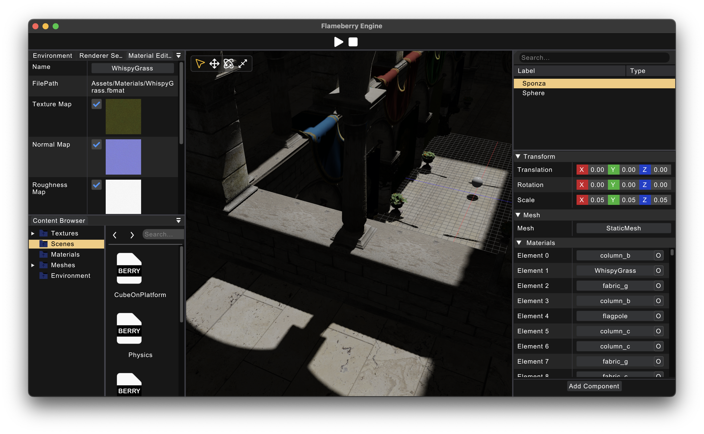

# Flameberry Engine

Flameberry Engine is a C++ Game Engine based upon the Vulkan Graphics API and is currently under development. My goal is to build a capable fast and efficient 3D game engine which can ship games on platforms like macOS, Windows, and Linux, and maybe Consoles, PlayStations, Android and iOS in the future!

***

## Build Requirements:
1. Vulkan/MoltenVK support
2. Python OR CMake
3. C++17 Compiler

## Build Steps:
1. Clone the repository using:   `git clone --recursive https://github.com/flameberry/flameberry-engine <folder-name>`
2. Run the `scripts/generate_project.py` script to setup Nvidia PhysX and generate project files.
3. Open the project file using an IDE and build it and run it.

## Third party libs:
1. GLFW
2. Vulkan SDK
3. glm
4. Dear ImGui
5. ImGuizmo
6. stb
7. Tiny OBJ Loader
8. Yaml-CPP
9. Nvidia PhysX