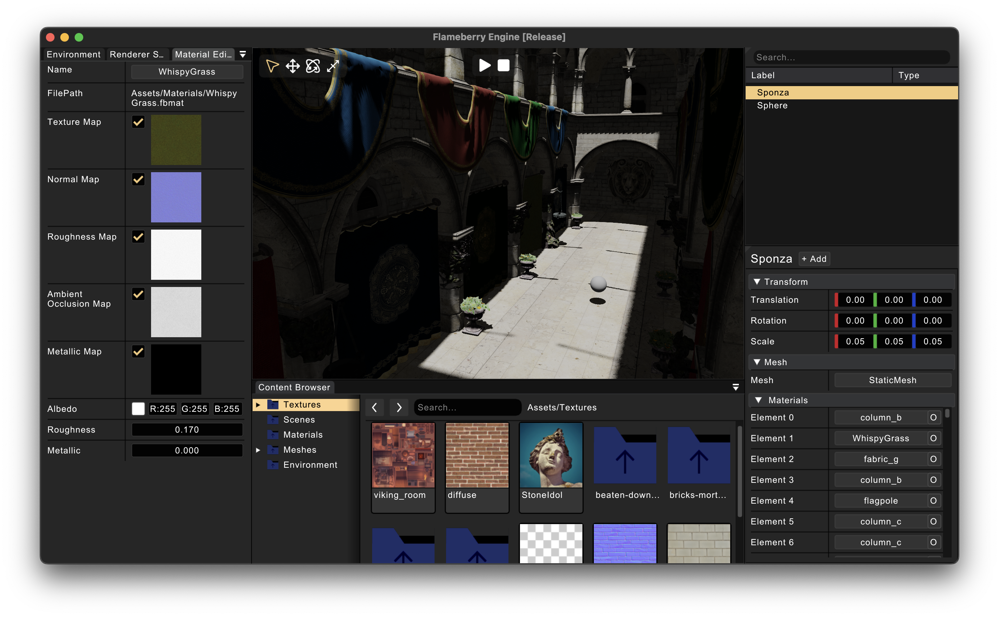

# Flameberry Engine

Flameberry Engine is a C++ Game Engine based upon the Vulkan Graphics API and is currently under development. My goal is to build a capable fast and efficient 3D game engine which can ship games on platforms like macOS, Windows, and Linux, and maybe Consoles, PlayStations, Android and iOS in the future!

***

## Build Requirements:
1. C++17 Compiler
2. Vulkan/MoltenVK support
3. Python
4. CMake (Preferred)
5. For Windows, Visual Studio is required to build PhysX SDK

<u>Note:</u> If you have Visual Studio version less than 17 installed then in the `Scripts/Win-GenProjects.bat` change the CMake Generator from `Visual Studio 17 2022` to the appropriate version that you have

## Build Steps:
1. Clone the repository using:   `git clone --recursive https://github.com/flameberry/FlameberryEngine`
2. Run the `Scripts/Setup.py` script to setup all the dependencies and generate project files.
3. Open the project file using an IDE and build it and run it.
4. After running the Engine for the first time, if you want to add new files or configurations, just add them and run `Win-GenProjects.bat` or `Unix-GenProjects.sh` for generating Visual Studio or Xcode projects respectively. Optionally you can run `Win-AutoGenAndBuild.bat` or `Unix-AutoGenAndBuild.sh` if you don't use those IDEs.

## Third party libs:
1. GLFW
2. Vulkan SDK
3. glm
4. Dear ImGui
5. ImGuizmo
6. stb
7. fmtlib
8. Tiny OBJ Loader
8. Yaml-CPP
10. Nvidia PhysX
11. Microsoft Dotnet